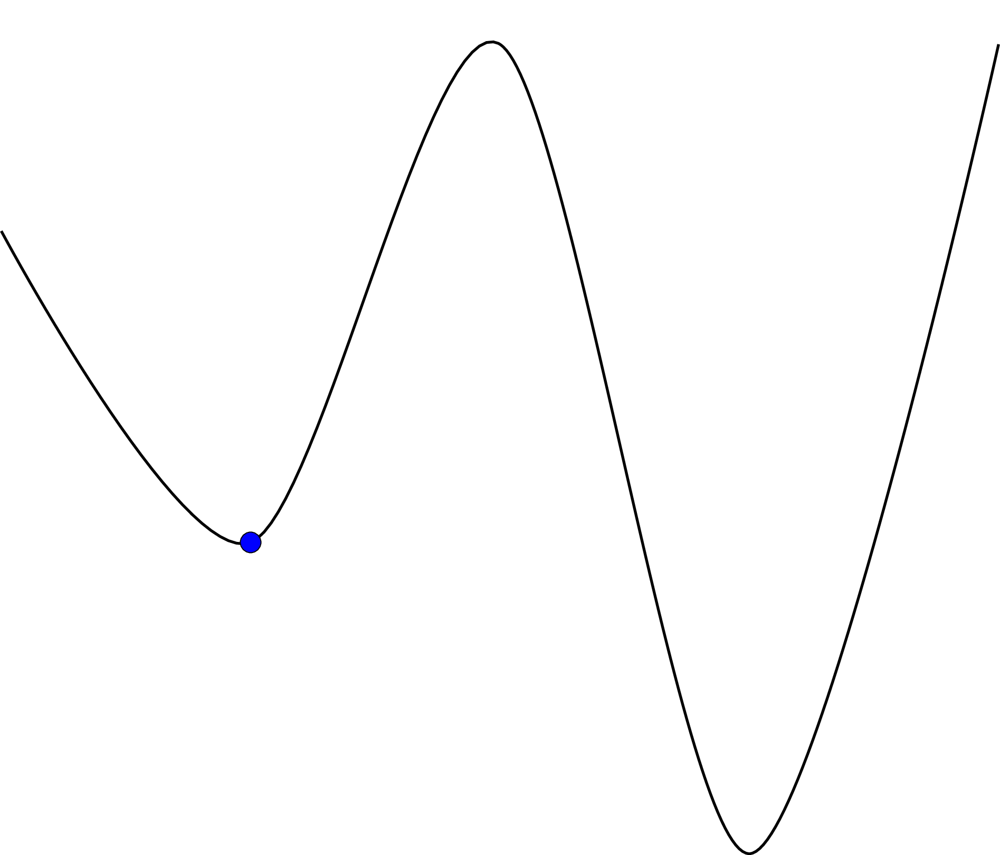
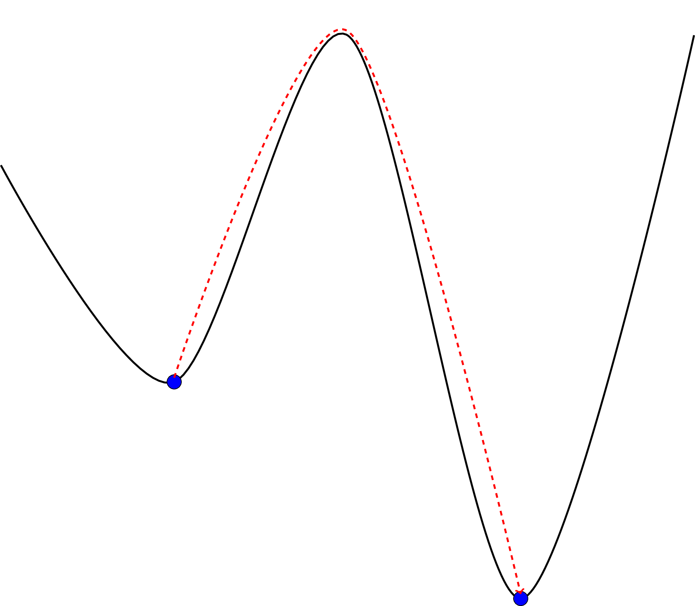

.. _heuristics:

Heuristics
==========

The mathematical problem described in :ref:`mathematical-model` can be solved
using linear programming which is guaranteed to give the optimal solution. This
can be computationally expensive, thus :code:`conference_scheduler` includes the
ability to search the solution space in an efficient manner to obtain if not the
best solution: a very good one.

A good overview of the main ideas behind these types of algorithms can be found
in [Aarts1997]_.

One subset of these types of algorithms is called neighbourhood searches. This
involves defining a neighbourhood of a candidate solution. In
:code:`conference_scheduler`, the neighbourhood of a matrix :math:`X` is defined
as the matrix that corresponds to moving a single event to another slot. If the
new slot is currently being used by another event the two events are swapped.

The general format of a neighbourhood search is to randomly select an element in
the neighbourhood of :math:`X` and either accept it or not as the new current
solution according to a given criteria.

Hill climbing
+++++++++++++

The Hill climbing algorithm has the most elementary
acceptance criteria for a new solution. If the new solution has a better score
then it is accepted.

The downside to this greedy approach is that by immediately accepting the better
solution the algorithm can arrive at a local optimal: a hill top that is not the
highest hill.

Note that the objective functions used in :code:`conference_scheduler` are
minimised. Whilst, mathematically this is equivalent, the analogy of finding the
highest hill through hill climbing fails and we are in fact looking for the
lowest valley.

Simulated annealing
+++++++++++++++++++

This algorithm will accept a worse solution with a given probability. However
this probability will decrease over time. Thus, the algorithm spends time at the
beginning exploring the search space before beginning to hone in to a better
solution. The name of this algorithm comes from the concept of annealing in
metallurgy. A good overview of this is given in [Henderson2003]_.

This in essence allows our search to "jump" away from local optima.

